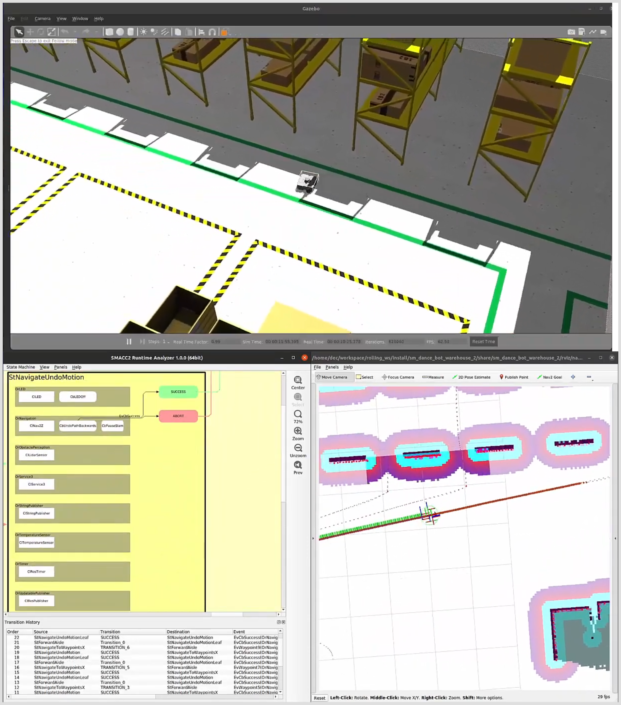

# Pablo Iñigo Blasco - Robot Simulation Portfolio - Demos and Technology Samples

This portfolio showcases a selection of simulation projects in this area that I have been able to work on and that are publicly available or I have permission to show. These demos are representative examples of projects created independently or with teams under my leadership, illustrating the full lifecycle of simulation development with an emphasis on practical applications and realistic robotic behavior.

---

## [P001 - Autoware and SVL Simulation for Autonomous Vehicles](https://www.dropbox.com/scl/fi/ygnbxx0pqw6shmrgc01pa/2022-01-21-21-05-19_2-autoware-Final.mp4?rlkey=3isp8b2jccr71of2l99mluf93&dl=0)

<table class="content-table">
  <tr>
    <td width="55%">
      Using the SVL simulator, this project involved integrating the Autoware framework with SMACC-based state machine control for autonomous vehicle navigation. This project provided in-depth exposure to autonomous vehicle architecture, from route planning to motion control, and served as a comprehensive testbed for full vehicle navigation stacks.
        
      <a href="https://www.dropbox.com/scl/fi/ygnbxx0pqw6shmrgc01pa/2022-01-21-21-05-19_2-autoware-Final.mp4?rlkey=3isp8b2jccr71of2l99mluf93&dl=0">Watch Video</a>
    </td>
    <td width="45%">
      
    </td>
  </tr>
</table>

---

## [P002 - IsaacSim Warehouse Exploration for Nvidia](https://www.dropbox.com/scl/fi/5hy5m0yzjc7wx0zyhlg6v/Autonomous-Exploration-Mapping-with-SMACC-inside-Isaac-Sim-XS5ktWK9F7w.webm?rlkey=nykxxwc8a3u7g57d2ftecm7uw&dl=0)

<table class="content-table">
  <tr>
    <td width="55%">
      This project for Nvidia involved configuring IsaacSim for warehouse exploration, utilizing Navigation2 and SMACC for autonomous navigation. I designed the scenario to simulate efficient robot movement through a large indoor space, tackling layout-specific pathfinding and exploration challenges. This project also had significance in motion planning where RRT exploration algorithms and SMACC mission planning were developed for autonomous mapping.
        
      <a href="https://www.dropbox.com/scl/fi/5hy5m0yzjc7wx0zyhlg6v/Autonomous-Exploration-Mapping-with-SMACC-inside-Isaac-Sim-XS5ktWK9F7w.webm?rlkey=nykxxwc8a3u7g57d2ftecm7uw&dl=0">Watch Video</a>
    </td>
    <td width="45%">
      
    </td>
  </tr>
</table>

---

## [P003 - IsaacSim – Wheeled Robot Kinematics Testing](https://www.dropbox.com/scl/fi/1suxnatav0icx3rtibpxr/2024-01-11-11-23-45_x_steer_isaacsim.mkv?rlkey=uh4yt35xz8jck777cvf5llr6k&dl=0)

<table class="content-table">
  <tr>
    <td width="55%">
      This project explored kinematic control for multi-wheeled robots using IsaacSim. I configured joint controls to achieve precise base movement for various vehicle types. A highlight of this project was managing steering and drive coordination for a complex multi-steering vehicle, pushing IsaacSim's capabilities for dynamic motion across different kinematic configurations.
        
      <a href="https://www.dropbox.com/scl/fi/1suxnatav0icx3rtibpxr/2024-01-11-11-23-45_x_steer_isaacsim.mkv?rlkey=uh4yt35xz8jck777cvf5llr6k&dl=0">Watch Video</a>
    </td>
    <td width="45%">
      
    </td>
  </tr>
</table>

---

## [P004 - ROS2 Navigation Stack with Unreal Engine Integration](https://www.dropbox.com/scl/fi/7s3d8c1pth8kllrj8ot9n/2023-08-15-23-16-09-unreal-engine-art-gallery.mp4?rlkey=tki20qnaosl4l6o58yxz6bnvb&dl=0)

<table class="content-table">
  <tr>
    <td width="55%">
      For this demonstration, I combined the ROS2 Navigation stack with Unreal Engine and rclUE, creating a fully controlled simulated environment. My responsibilities included setting up the ROS2 controllers, sensors, and navigation components to allow seamless movement through a structured virtual environment.
        
      <a href="https://www.dropbox.com/scl/fi/7s3d8c1pth8kllrj8ot9n/2023-08-15-23-16-09-unreal-engine-art-gallery.mp4?rlkey=tki20qnaosl4l6o58yxz6bnvb&dl=0">Watch Video</a>
    </td>
    <td width="45%">
      
    </td>
  </tr>
</table>

---

## [P005 - Research in Wheeled Mobile Robot Kinematic Control](https://www.dropbox.com/scl/fi/esx5pkcg8r8fc38mzmcvx/2023.12-VIDEO-resumen-xsteer-control-multiple-wheels-gazebo.mp4?rlkey=pndtb57979nmgo16exifyh0vo&dl=0)

<table class="content-table">
  <tr>
    <td width="55%">
      This research-oriented project investigated control mechanisms for various wheeled robot configurations (Ackermann, differential, dual-steer, and x-steer). I designed both the simulation environments and custom controllers, contributing to deeper insights into kinematic adaptability for mobile robots. This work serves as a foundation for further exploration in adaptive robotic control.
        
      <a href="https://www.dropbox.com/scl/fi/esx5pkcg8r8fc38mzmcvx/2023.12-VIDEO-resumen-xsteer-control-multiple-wheels-gazebo.mp4?rlkey=pndtb57979nmgo16exifyh0vo&dl=0">Watch Video</a>
    </td>
    <td width="45%">
      
    </td>
  </tr>
</table>

---

## [P006 - Real-Time Shared Control with Stage Simulator](https://www.dropbox.com/scl/fi/ihtyuemfca62pxjst077x/2011.Shared-Control-Dynamic-Window-Approach-Shared-DWA-uSe893aEYEk.mp4?rlkey=j5m7e1e06qxptxrib9u39ekjv&dl=0)

<table class="content-table">
  <tr>
    <td width="55%">
      In 2012, this research focused on developing custom controllers for high-speed shared control, combining joystick input with autonomous collision avoidance. Using the Stage simulator, I demonstrated semi-autonomous control, ensuring non-holonomic robots avoided collisions while maintaining high-speed movement. This project culminated in the publication of a paper titled "The Shared Control Dynamic Window Approach for Non-Holonomic Semi-Autonomous Robots." This project also had significance in motion planning where a modified DWA algorithm for real-time shared control was developed.
        
      <a href="https://www.dropbox.com/scl/fi/ihtyuemfca62pxjst077x/2011.Shared-Control-Dynamic-Window-Approach-Shared-DWA-uSe893aEYEk.mp4?rlkey=j5m7e1e06qxptxrib9u39ekjv&dl=0">Watch Video</a>
    </td>
    <td width="45%">
      
    </td>
  </tr>
</table>

---

## [P007 - AIRSIM Cloud Batch Testing for Microsoft](https://www.dropbox.com/scl/fi/79mcdakyy5q60whp7hbj3/AIRSIM-cloud-testing.mp4?dl=0)

<table class="content-table">
  <tr>
    <td width="55%">
      In this project for Microsoft, I worked on automating batch testing for the AIRSIM simulator in Azure cloud, handling GPU resources and Docker containers. This project was key for large-scale automated testing scenarios, optimizing resource allocation and management.
        
      <a href="https://www.dropbox.com/scl/fi/79mcdakyy5q60whp7hbj3/AIRSIM-cloud-testing.mp4?dl=0">Watch Video</a>
    </td>
    <td width="45%">
      
    </td>
  </tr>
</table>

---

## [P008 - Warhog Robot Mining Navigation – Unreal Engine](https://www.dropbox.com/scl/fi/hdyhm1dc7gk0k9al3fyk2/2023-08-29-SMACC2-unreal-UE-mine-warhog-waypoints.mp4?rlkey=e8b1arq6irw9qgdk00hf06y8m&dl=0)

<table class="content-table">
  <tr>
    <td width="55%">
      This project demonstrates a Warhog mining robot navigating a simulated mine, utilizing the rclUE framework to integrate ROS2 with Unreal Engine. The demo focuses on custom configuration of robotic dynamics, joint control, and base controller development for realistic handling over rough terrain.
        
      <a href="https://www.dropbox.com/scl/fi/hdyhm1dc7gk0k9al3fyk2/2023-08-29-SMACC2-unreal-UE-mine-warhog-waypoints.mp4?rlkey=e8b1arq6irw9qgdk00hf06y8m&dl=0">Watch Video</a>
    </td>
    <td width="45%">
      
    </td>
  </tr>
</table>

---

## [P009 - IsaacSim – Carter Tricycle Docking & Battery Charging](https://www.dropbox.com/scl/fi/3stscugoptervds65ujqx/Dance-Party-at-AWS-Warehouse-Demo-1-gLH37M3e4e0.mkv?rlkey=izwjhwlei878nc9i16lk7r1id&dl=0)
<table class="content-table"> <tr> <td width="55%"> This advanced IsaacSim demonstration implements a full docking and battery-charging workflow for the Carter tricycle robot. The system combines visual servoing, using both 3D foundation pose estimation of the docking geometry and 2D AprilTag markers, with mission-level orchestration powered by SMACC2. The robot performs multiple navigation tasks in a warehouse environment, autonomously approaching the dock, aligning, and completing the charging maneuver with sub-centimeter precision. This project also had significance in motion planning where visual servoing algorithms with tricycle kinematic constraints were implemented.    <a href="https://www.dropbox.com/scl/fi/53u29nr03z9l0xowdfp3y/2025.5-isaacsim-carter-dock-battery-charge.mp4?rlkey=ynzuqfl5phmy52ksq3xerczjj&dl=0">Watch Video</a> </td> <td width="45%">  </td> </tr> </table>

---

## [P010 - Warehouse Mission-Level & Navigation Dancing Demo (Gazebo + Nav2 + SMACC2)](https://www.dropbox.com/scl/fi/3stscugoptervds65ujqx/Dance-Party-at-AWS-Warehouse-Demo-1-gLH37M3e4e0.mkv?rlkey=izwjhwlei878nc9i16lk7r1id&dl=0)
<table class="content-table"> <tr> <td width="55%"> This Gazebo Classic demonstration shows mission-level behaviors orchestrated using SMACC2 together with the Navigation2 stack. A differential-drive robot executes a variety of scripted capabilities: forward and backward trajectories, pure spin motions, free navigation, trajectory undoing, and a coordinated "dance routine" inside a warehouse environment. The demo highlights how SMACC2 can express high-level robot behavior sequences on top of Nav2 primitives. This project also had significance in system architecture where hierarchical state machine design for mission control was developed.    **Videos:** <a href="https://www.dropbox.com/scl/fi/3stscugoptervds65ujqx/Dance-Party-at-AWS-Warehouse-Demo-1-gLH37M3e4e0.mkv?rlkey=izwjhwlei878nc9i16lk7r1id&dl=0">Demo 1</a> · <a href="https://www.dropbox.com/scl/fi/uyq7pqbp2z6413pogawwn/Dance-Party-at-AWS-Warehouse-Demo-2-A3kmCQS_ww8.mkv?rlkey=z0cvx7nhpcy5i72in3wp221pg&dl=0">Demo 2</a> · <a href="https://www.dropbox.com/scl/fi/7tbyr3a04w4k7ntsshmfe/Dance-Party-at-AWS-Warehouse-Demo-3-_4QZdvdTptI.mkv?rlkey=bgahwp6m6sh453i4rs1a0wa2d&dl=0">Demo 3</a> </td> <td width="45%">  </td> </tr> </table>

---

## [P011 - Navigation and Manipulation with ROS2 in Gazebo Classic](https://www.dropbox.com/scl/fi/79mcdakyy5q60whp7hbj3/Navigation-Manipulation-Gazebo.mp4?dl=0)

<table class="content-table">
  <tr>
    <td width="55%">
      In this demo, I integrated ROS2-based navigation and manipulation capabilities with Gazebo Classic to automate sorting tasks using a Fetch robot (`fetch_wine`, `tabletop_sort_boxes`). This project combined robotic perception with navigation and manipulation, enabling the robot to identify, pick, and place objects at designated locations—showcasing multi-functional robotic operation.
        
      <a href="https://www.dropbox.com/scl/fi/79mcdakyy5q60whp7hbj3/Navigation-Manipulation-Gazebo.mp4?dl=0">Watch Video</a>
    </td>
    <td width="45%">
      
    </td>
  </tr>
</table>

---

## [P012 - New GazeboSIM for Microsoft: Large-Scale Simulation](https://www.dropbox.com/scl/fi/29rj34hqz3dl2/LargeScaleSimulation-GazeboSIM.mp4?dl=0)

<table class="content-table">
  <tr>
    <td width="55%">
      For Microsoft, I used the latest Gazebo Harmonic to load Spot, drones, and humanoid robots into expansive simulation environments controlled via ROS2 and Microsoft tools. This demo evaluated Gazebo's performance for large-scale simulations with standard GPU hardware, integrating GPS and camera sensors with basic motion commands to assess feasibility for high-demand simulations.
        
      <a href="https://www.dropbox.com/scl/fi/29rj34hqz3dl2/LargeScaleSimulation-GazeboSIM.mp4?dl=0">Watch Video</a>
    </td>
    <td width="45%">
      
    </td>
  </tr>
</table>

---
