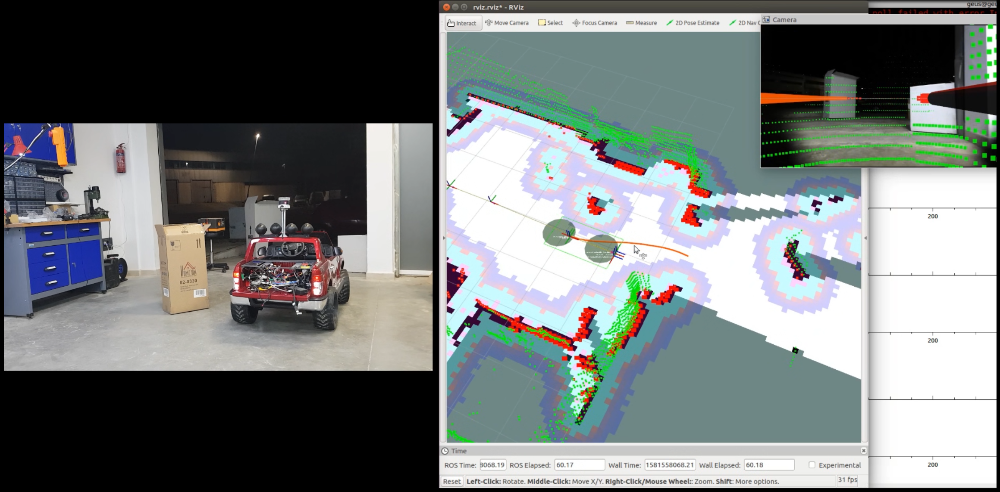
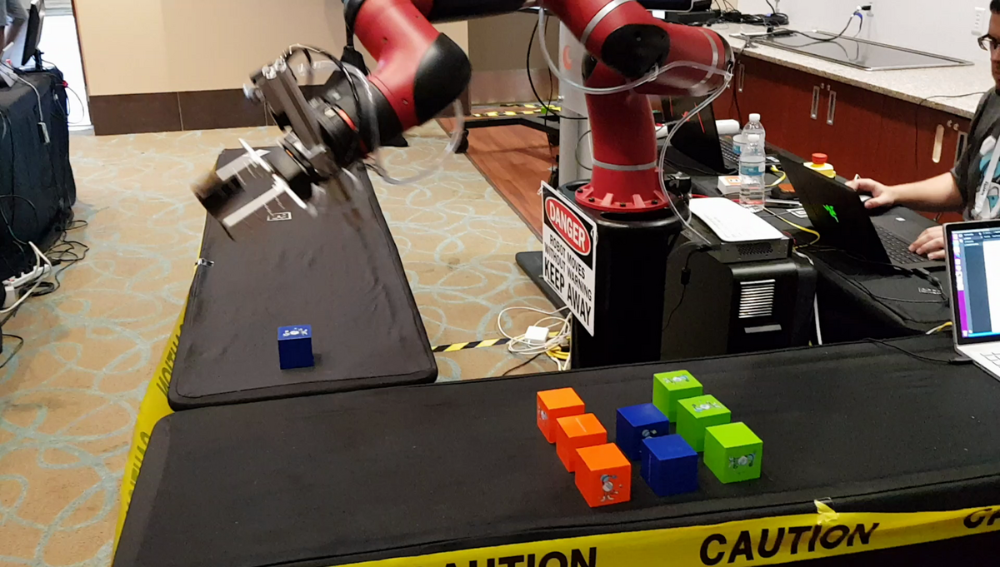
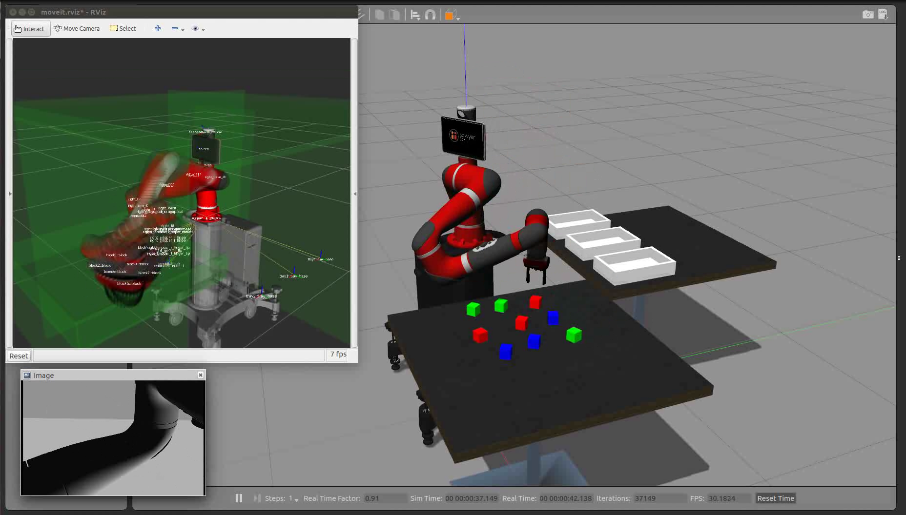

# Pablo Iñigo Blasco - AI Perception & Cognitive Systems Portfolio

Technical portfolio showcasing a selection of AI perception and cognitive systems projects in this area that I have been able to work on and that are publicly available or I have permission to show. This portfolio demonstrates advanced computer vision, AI perception systems, and cognitive robotics applications. Focus on real-world deployment of AI-driven perception for safety, surveillance, and intelligent robot behavior.

---

## [P015 - Mobile AI Platform: Person Detection & PPE Compliance Monitoring](https://www.dropbox.com/scl/fi/gsraxx5vrmbiuamq136xk/2018.Smart-Car-out-18-024028-combined-mobile-ai-platform.mp4?rlkey=8pdyohek1dqzm4ptiyf3xj1im&dl=0)

<table class="content-table">
  <tr>
    <td width="55%">
      <strong>AI Perception for Workplace Safety:</strong> Implemented comprehensive computer vision system for person detection and PPE (Personal Protective Equipment) compliance monitoring, deployed on autonomous mobile platform for workplace safety surveillance and risk compliance enforcement.
        
      <strong>Computer Vision Architecture:</strong>
      <ul>
        <li><strong>Person Detection:</strong> Real-time human detection and tracking in industrial environments</li>
        <li><strong>PPE Detection:</strong> Automated identification of safety equipment usage (helmets, vests, gloves)</li>
        <li><strong>Compliance Monitoring:</strong> Risk assessment and safety protocol enforcement</li>
        <li><strong>Cognitive Surveillance:</strong> Intelligent behavior analysis for workplace safety</li>
      </ul>
      
      <strong>AI Integration:</strong>
      <ul>
        <li><strong>Edge AI Processing:</strong> Real-time inference on mobile platform</li>
        <li><strong>Multi-camera Fusion:</strong> Stereo and mono camera integration for robust detection</li>
        <li><strong>Autonomous Patrol:</strong> Mobile platform navigation with AI perception overlay</li>
        <li><strong>Alert Systems:</strong> Real-time safety violation reporting and documentation</li>
      </ul>
      
      <strong>Innovation:</strong> First autonomous mobile safety surveillance system combining AI perception with mobile robotics for workplace risk compliance monitoring. This project also had significance in system architecture where hardware integration was developed, and in motion planning where autonomous navigation was implemented.
        
      <a href="https://www.dropbox.com/scl/fi/gsraxx5vrmbiuamq136xk/2018.Smart-Car-out-18-024028-combined-mobile-ai-platform.mp4?rlkey=8pdyohek1dqzm4ptiyf3xj1im&dl=0">Watch Video</a>
    </td>
    <td width="45%">
      
    </td>
  </tr>
</table>

---

## [P016 - OpenCV Object Detection for Sawyer Manipulation (Microsoft)](https://www.dropbox.com/s/xiacde999fngres/sawyer%2020180927_175441.mp4?dl=0)

<table class="content-table">
  <tr>
    <td width="55%">
      <strong>OpenCV-based perception feeding manipulation:</strong> For this Microsoft project on a Sawyer 7-DoF cobot, I implemented a computer vision pipeline using OpenCV that detected multi-coloured cubes and produced object poses consumed by the manipulation planner. The challenge was robust detection across varying lighting and table conditions, combined with sub-centimetre pose accuracy needed for reliable grasping.
        
      <strong>Pipeline architecture:</strong>
      <ul>
        <li><strong>Object detection:</strong> Colour segmentation and contour-based detection of the target cubes</li>
        <li><strong>Pose estimation:</strong> Centroid and orientation extraction in the camera frame, transformed to robot base frame using calibrated camera-to-robot extrinsics</li>
        <li><strong>Manipulation integration:</strong> Detected poses streamed to MoveIt as grasp targets, with the manipulation planner consuming them in real time</li>
        <li><strong>Sim/real symmetry:</strong> Same perception code path running on virtual cameras in simulation and on the real RGB stream</li>
      </ul>
      
      <strong>Innovation:</strong> End-to-end perception → planning → execution loop validated first in simulation and transferred to physical hardware without modification. This project also had significance in motion planning (MoveIt-based manipulation) and system architecture (perception / planning / hardware integration).
        
      <strong>Videos:</strong> <a href="https://www.dropbox.com/s/xiacde999fngres/sawyer%2020180927_175441.mp4?dl=0">Real Hardware</a> · <a href="https://www.dropbox.com/s/1y7qb5rqx8l4piz/2019.sawyer-complete.ogv?dl=0">Simulation</a>
    </td>
    <td width="45%">
      <strong>Real hardware:</strong> 
      
        
      <strong>Simulation:</strong> 
      
    </td>
  </tr>
</table>

---