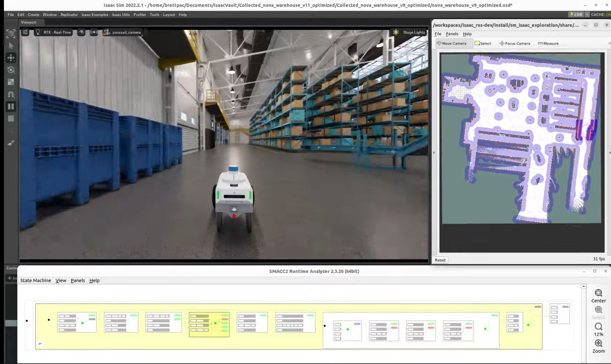
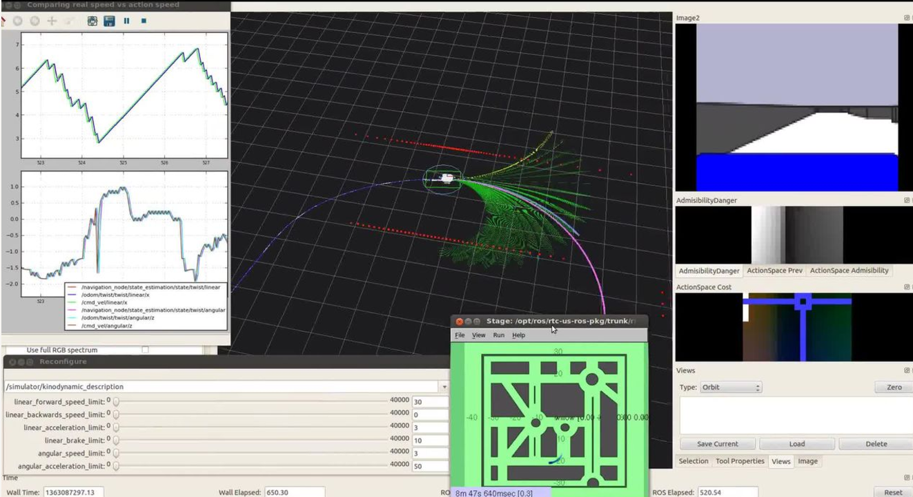
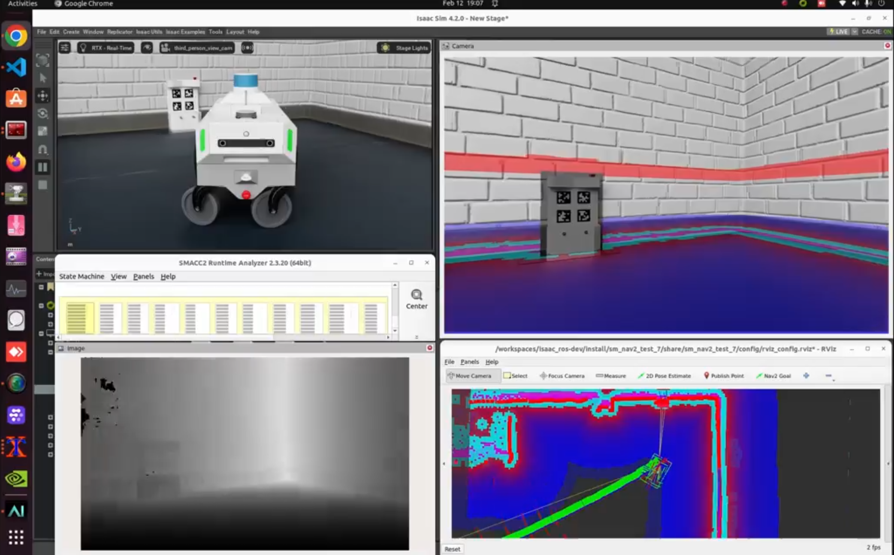
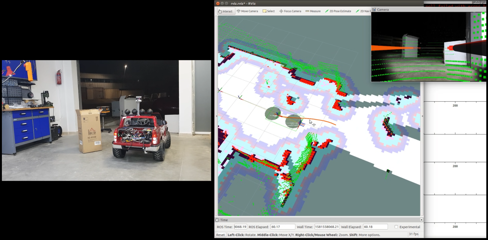
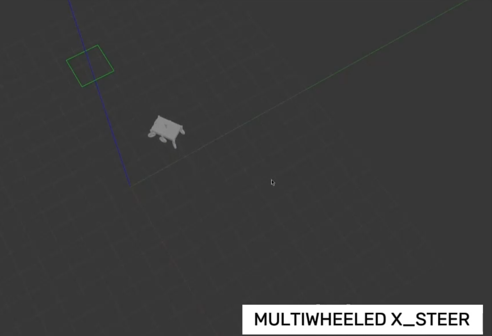

# Pablo Iñigo Blasco - Motion Planning & Control Systems Portfolio

Technical portfolio showcasing a selection of motion planning and control projects in this area that I have been able to work on and that are publicly available or I have permission to show. This portfolio demonstrates advanced motion planning algorithms, control systems, and navigation techniques. Focus on novel approaches to robot motion control, kinematic modeling, and precision control systems.

---

## [P002 - Autonomous Exploration: RRT Algorithms & SMACC Mission Planning](https://www.dropbox.com/scl/fi/5hy5m0yzjc7wx0zyhlg6v/Autonomous-Exploration-Mapping-with-SMACC-inside-Isaac-Sim-XS5ktWK9F7w.webm?rlkey=nykxxwc8a3u7g57d2ftecm7uw&dl=0)

<table class="content-table">
  <tr>
    <td width="55%">
This project was quite exciting because it involved porting and adapting RRT (Rapidly-Exploring Random Tree) algorithms from ROS to ROS2 for autonomous exploration. Working with the Nova Carter AMR in IsaacSim, I integrated these algorithms with SMACC state machine framework to create a comprehensive exploration system for warehouse environments.
        
      The challenge here was getting all the pieces to work together: the modified RRT algorithms for efficient mapping, the SMACC state machine for mission-level control, and the complete Nav2 stack integration with slam_toolbox. What made this particularly interesting was optimizing trajectory generation for warehouse navigation while maintaining real-time SLAM capabilities.
        
      This project also had significance in simulation where NVIDIA IsaacSim provided the testing environment for algorithm validation. The result was a robust autonomous exploration and mapping system that could handle structured environments effectively.
        
      <a href="https://www.dropbox.com/scl/fi/5hy5m0yzjc7wx0zyhlg6v/Autonomous-Exploration-Mapping-with-SMACC-inside-Isaac-Sim-XS5ktWK9F7w.webm?rlkey=nykxxwc8a3u7g57d2ftecm7uw&dl=0">Watch Video</a> · <a href="https://www.linkedin.com/posts/pabloinigoblasco_id-like-to-show-off-an-autonomous-exploration-activity-7122635798205652992-u2xs">LinkedIn Post</a>
    </td>
    <td width="45%">
      
    </td>
  </tr>
</table>

---

## [P006 - Real-Time Shared Control Dynamic Window Approach](https://www.dropbox.com/scl/fi/ihtyuemfca62pxjst077x/2011.Shared-Control-Dynamic-Window-Approach-Shared-DWA-uSe893aEYEk.mp4?rlkey=j5m7e1e06qxptxrib9u39ekjv&dl=0)

<table class="content-table">
  <tr>
    <td width="55%">
This was one of my earlier research projects that I'm particularly proud of - developing custom shared control algorithms that blend human joystick input with autonomous collision avoidance using the Dynamic Window Approach (DWA). The idea was to create semi-autonomous systems where humans could maintain control while the robot handled collision avoidance.
        
      The tricky part was modifying the DWA algorithm to work in real-time with human input, while respecting non-holonomic constraints and maintaining high-speed collision avoidance without interfering with human intent. This project also had significance in simulation where Stage simulator was used for real-time testing and validation.
        
      The work resulted in a publication: "The Shared Control Dynamic Window Approach for Non-Holonomic Semi-Autonomous Robots" and was actually the first implementation of shared control DWA that enabled high-speed human-supervised autonomous navigation.
        
      <a href="https://www.dropbox.com/scl/fi/ihtyuemfca62pxjst077x/2011.Shared-Control-Dynamic-Window-Approach-Shared-DWA-uSe893aEYEk.mp4?rlkey=j5m7e1e06qxptxrib9u39ekjv&dl=0">Watch Video</a>
    </td>
    <td width="45%">
      
    </td>
  </tr>
</table>

---

## [P009 - Visual Servoing with Tricycle Kinematics: Precision Docking Control](https://www.dropbox.com/scl/fi/53u29nr03z9l0xowdfp3y/2025.5-isaacsim-carter-dock-battery-charge.mp4?rlkey=ynzuqfl5phmy52ksq3xerczjj&dl=0)

<table class="content-table">
  <tr>
    <td width="55%">
Working with the Carter tricycle robot, this project was all about achieving precision docking with sub-centimeter accuracy. The challenge was developing visual servoing algorithms that could handle the unique kinematic constraints of a tricycle robot while integrating multiple pose estimation techniques.
        
      What made this interesting was combining 3D foundation models with 2D AprilTag fusion for robust pose estimation, then feeding that into a custom controller that understood tricycle steering and drive constraints. I used SMACC2 for the high-level mission planning and developed the low-level visual servoing with real-time trajectory correction loops that maintained kinematic feasibility.
        
      This project also had significance in simulation where IsaacSim provided the testing environment for battery charging workflows. The innovation here was being the first to integrate foundation model 3D pose estimation with tricycle kinematics for precision robotic docking.
        
      <a href="https://www.dropbox.com/scl/fi/53u29nr03z9l0xowdfp3y/2025.5-isaacsim-carter-dock-battery-charge.mp4?rlkey=ynzuqfl5phmy52ksq3xerczjj&dl=0">Watch Video</a>
    </td>
    <td width="45%">
      
    </td>
  </tr>
</table>

---

## [P015 - Mobile AI Platform: Ackermann Steering & TEB Navigation](https://www.dropbox.com/scl/fi/gsraxx5vrmbiuamq136xk/2018.Smart-Car-out-18-024028-combined-mobile-ai-platform.mp4?rlkey=8pdyohek1dqzm4ptiyf3xj1im&dl=0)

<table class="content-table">
  <tr>
    <td width="55%">
This project involved taking a physical mobile platform and implementing a complete motion planning and control system from scratch. The focus was on Ackermann steering dynamics and dealing with real-world constraints that you don't always encounter in simulation.
        
      I had to implement and calibrate the full Ackermann kinematic model for the physical platform, then adapt the TEB Local Planner to handle the steering dynamics, curvature limits, and safety envelopes. The integration work included connecting low-level motor control with high-level navigation and implementing dynamic replanning that respected the physical platform constraints.
        
      What I found rewarding was successfully adapting the ROS2 Nav2 stack for this real-world mobile platform with custom kinematic constraints and safety systems. This project also had significance in system architecture where comprehensive hardware integration and embedded systems were developed.
        
      <a href="https://www.dropbox.com/scl/fi/gsraxx5vrmbiuamq136xk/2018.Smart-Car-out-18-024028-combined-mobile-ai-platform.mp4?rlkey=8pdyohek1dqzm4ptiyf3xj1im&dl=0">Watch Video</a>
    </td>
    <td width="45%">
      
    </td>
  </tr>
</table>

---

## [P005 - Advanced Kinematic Controllers: Multi-Wheel Configuration Research](https://www.dropbox.com/scl/fi/esx5pkcg8r8fc38mzmcvx/2023.12-VIDEO-resumen-xsteer-control-multiple-wheels-gazebo.mp4?rlkey=pndtb57979nmgo16exifyh0vo&dl=0)

<table class="content-table">
  <tr>
    <td width="55%">
      This project was all about designing and implementing controllers for various wheeled robot configurations, demonstrating authority in kinematic modeling and dynamic control across different platforms. I developed controllers for everything from standard differential drive to complex redundant steering systems, exploring the full spectrum of wheeled robot kinematics.
        
      Working with multiple kinematic models - differential drive, tricycle, two-steer, and x-steer (redundant) configurations - I created custom controllers that could handle the unique constraints and capabilities of each system. The challenge was developing unified control approaches while respecting the specific kinematic and dynamic properties of each configuration.
        
      What made this particularly interesting was implementing these controllers in both simulation environments: Gazebo for traditional testing and IsaacSim for more advanced physics simulation. This dual-platform approach allowed me to validate the controllers under different simulation conditions and demonstrate their robustness across various scenarios.
        
      This work established authority in controller design and kinematic/dynamic control, showing how to systematically approach different wheeled robot configurations and create effective control strategies for each.
        
      <strong>Videos:</strong> <a href="https://www.dropbox.com/scl/fi/esx5pkcg8r8fc38mzmcvx/2023.12-VIDEO-resumen-xsteer-control-multiple-wheels-gazebo.mp4?rlkey=pndtb57979nmgo16exifyh0vo&dl=0">Gazebo Implementation</a> · <a href="https://www.dropbox.com/scl/fi/twt1yftzmzue24pqz5rdb/2024-01-09-multiwheel_x_steer_isaacsim.mkv?rlkey=nx0xdiwklp2cuprbm9lpqxard&dl=0">IsaacSim Version</a>
    </td>
    <td width="45%">
      
    </td>
  </tr>
</table>

---