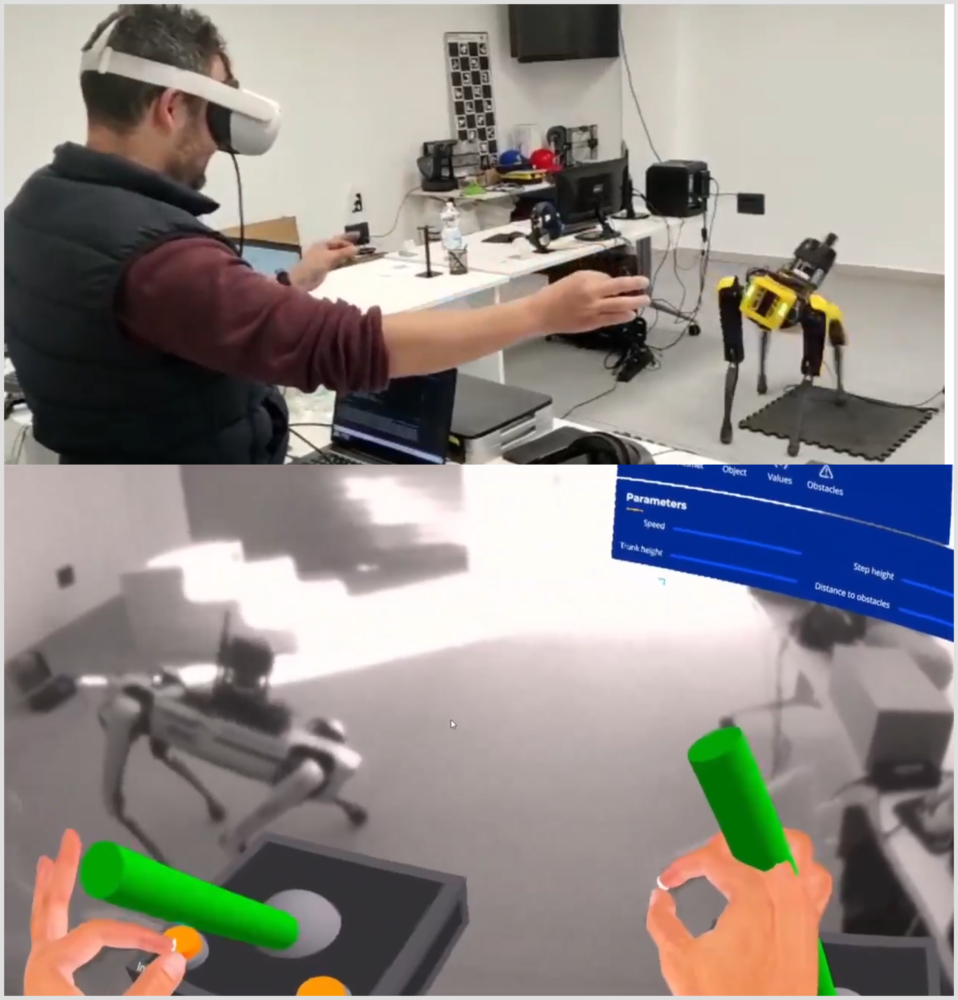
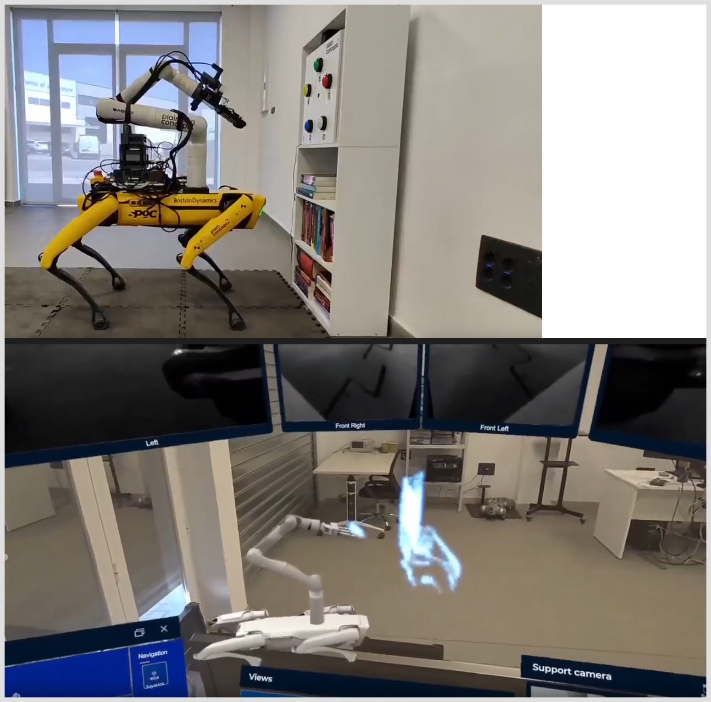

# Pablo Iñigo Blasco - System Architecture & Integration Portfolio

Technical portfolio showcasing a selection of system architecture and integration projects in this area that I have been able to work on and that are publicly available or I have permission to show. This portfolio demonstrates expertise in complex multi-platform robotics integration, cross-language system architecture, and novel technology stacks. Focus on ROS2-based architectures integrating embedded systems, mobile platforms, and edge AI computing.

---

## [P013 - MRLink - VR Navigation & Data Collection Architecture with a Quadruped Robot]

<table class="content-table">
  <tr>
    <td width="55%">
      <strong>Technical Architecture:</strong> Advanced VR-integrated navigation system for autonomous data collection missions. Led development of cross-platform architecture enabling AR glasses control of robotic mapping and reconnaissance operations.
        
      
      <strong>Cross-Platform Integration Stack:</strong>
      <ul>
        <li><strong>Android + C# + ROS2:</strong> First successful integration enabling AR glasses control of robotic systems</li>
        <li><strong>Custom ROS2 Driver:</strong> spot-sdk-cpp based node with Navigation2 integration</li>
        <li><strong>Modified rcldotnet:</strong> Android/Xamarin optimization for real-time data streaming</li>
        <li><strong>Edge AI Distribution:</strong> NVIDIA Jetson Xavier + Google Coral TPU architecture</li>
      </ul>
      
      <strong>Navigation & Sensing Architecture:</strong>
      <ul>
        <li><strong>Multi-sensor fusion:</strong> 3D LiDAR mapping + 360° cameras for environmental reconnaissance</li>
        <li><strong>Real-time SLAM:</strong> Autonomous navigation with VR operator oversight capability</li>
        <li><strong>Mission planning:</strong> Systematic data gathering in complex environments</li>
      </ul>
      
      <strong>Innovation:</strong> Pioneered Android↔C#↔ROS2 architecture enabling mobile VR devices as robot navigation control interfaces
        
      <strong>Videos:</strong> <a href="https://www.dropbox.com/scl/fi/w7hxeghhv6kutikgq73ho/2022.Meet-MRLINK-Spot.mp4?rlkey=1xfdkpo8yqumao0iqwy9mvl0a&dl=0">Meet MRLink</a> · <a href="https://www.dropbox.com/scl/fi/gt250oqa9yqcopjjuwk9u/video-holorobot-features-linkedin.mp4?rlkey=rurx22xzqismvjt4hdy8rosvu&dl=0">HoloRobot Features</a>
        
      <a href="https://www.linkedin.com/posts/pabloinigoblasco_in-the-last-few-months-i-had-the-opportunity-activity-7103189317027586048-f-89">Technical Architecture</a> · <a href="https://www.linkedin.com/posts/qmartinez_mrlink-in-neurondones-activity-7321147566786531328-ZLRL/">MRLink Post</a>
    </td>
    <td width="45%">
      
    </td>
  </tr>
</table>

---

## [P014 - NeuronDones - Hazardous Environment Teleoperation Architecture of a Quadruped Robot]

<table class="content-table">
  <tr>
    <td width="55%">
      <strong>Technical Architecture:</strong> Integrated manipulation system for hazardous environment operations combining VR teleoperation with multi-robot coordination. System enables precise manipulation tasks in nuclear, chemical, and high-radiation environments.
        
      
      <strong>Multi-Robot Integration:</strong>
      <ul>
        <li><strong>Platform Integration:</strong> Boston Dynamics Spot + Kinova Gen3 arm + Allegro Hand V4</li>
        <li><strong>VR Control Stack:</strong> Evergine-based immersive interface with haptic feedback</li>
        <li><strong>ROS2 Manipulation:</strong> Custom inverse kinematics solvers and control algorithms</li>
        <li><strong>Real-time Force Feedback:</strong> Tactile sensation transmission to VR operator</li>
      </ul>
      
      <strong>Sensor Integration Architecture:</strong>
      <ul>
        <li><strong>Thermal imaging:</strong> Azure Kinect integration for environmental assessment</li>
        <li><strong>Multi-modal sensing:</strong> Thermal + depth + tactile sensor fusion</li>
        <li><strong>Symbiotic control:</strong> Custom algorithms for human-robot operation</li>
      </ul>
      
      <strong>Innovation:</strong> First VR-based multi-robot manipulation system for hazardous environments with integrated haptic feedback
        
      <strong>Videos:</strong> <a href="assets/neuron_dones.mp4">Main Demo</a> · <a href="https://www.dropbox.com/scl/fi/4w2duihdmz7fjrueyl2rd/2024-04-17_09-38-06-demo2-neuron-dones-xarm.mkv?rlkey=cmun89u4gmdjq6rli5ngnw64e&dl=0">xArm Integration (WIP)</a>
        
      <a href="https://www.linkedin.com/posts/jcanton_neurondones-evergine-ros2-activity-7389571943223517184-mHrK">Technical Demo</a>
    </td>
    <td width="45%">
      
    </td>
  </tr>
</table>

---

## [P010 - Hierarchical State Machine Architecture: SMACC2 + Nav2 Mission Control](https://www.dropbox.com/scl/fi/3stscugoptervds65ujqx/Dance-Party-at-AWS-Warehouse-Demo-1-gLH37M3e4e0.mkv?rlkey=izwjhwlei878nc9i16lk7r1id&dl=0)

<table class="content-table">
  <tr>
    <td width="55%">
      <strong>Technical Architecture:</strong> This project also had significance in simulation where Gazebo Classic provided the testing environment for mission-level behavior validation.
      <ul>
        <li><strong>State Machine Framework:</strong> SMACC2-based hierarchical mission control orchestrating Nav2 primitives</li>
        <li><strong>Navigation Stack Integration:</strong> Custom behavior trees interfacing with Navigation2 planners</li>
        <li><strong>Trajectory Management:</strong> Real-time path generation, execution monitoring, and rollback capabilities</li>
        <li><strong>Mission Sequencing:</strong> Complex behavior composition: navigation + pure rotation + trajectory undo</li>
      </ul>
      
      <strong>Implementation Details:</strong>
      <ul>
        <li>Custom ROS2 action servers for synchronized motion primitives</li>
        <li>State-based recovery behaviors with automatic error handling</li>
        <li>Real-time trajectory visualization and debugging framework</li>
        <li>Modular behavior library for reusable mission components</li>
      </ul>
      
      <strong>Innovation:</strong> Demonstrated scalable approach to complex multi-behavior robot missions using formal state machine architecture
        
      <strong>Videos:</strong> <a href="https://www.dropbox.com/scl/fi/3stscugoptervds65ujqx/Dance-Party-at-AWS-Warehouse-Demo-1-gLH37M3e4e0.mkv?rlkey=izwjhwlei878nc9i16lk7r1id&dl=0">Demo 1</a> · <a href="https://www.dropbox.com/scl/fi/uyq7pqbp2z6413pogawwn/Dance-Party-at-AWS-Warehouse-Demo-2-A3kmCQS_ww8.mkv?rlkey=z0cvx7nhpcy5i72in3wp221pg&dl=0">Demo 2</a> · <a href="https://www.dropbox.com/scl/fi/7tbyr3a04w4k7ntsshmfe/Dance-Party-at-AWS-Warehouse-Demo-3-_4QZdvdTptI.mkv?rlkey=bgahwp6m6sh453i4rs1a0wa2d&dl=0">Demo 3</a>
    </td>
    <td width="45%">
      
    </td>
  </tr>
</table>

---

## [P015 - Mobile AI Platform Robotization](https://www.dropbox.com/scl/fi/gsraxx5vrmbiuamq136xk/2018.Smart-Car-out-18-024028-combined-mobile-ai-platform.mp4?rlkey=8pdyohek1dqzm4ptiyf3xj1im&dl=0)

<table class="content-table">
  <tr>
    <td width="55%">
      <strong>Full-Stack Physical Robotization:</strong> Converted a non-robotized mobile base into an autonomous AI-enabled platform through comprehensive hardware integration and embedded systems development.
        
      
      <strong>Hardware Integration Architecture:</strong>
      <ul>
        <li><strong>Drive & Steering Systems:</strong> Integrated motor controllers with CAN/UART interfaces</li>
        <li><strong>Sensor Integration:</strong> Added encoders, stereo & mono cameras, LiDAR sensors from scratch</li>
        <li><strong>Embedded Control:</strong> Real-time control loops and kinematic modeling implementation</li>
        <li><strong>Perception Stack:</strong> Multi-sensor fusion for localization and navigation</li>
      </ul>
      
      <strong>System-Level Implementation:</strong>
      <ul>
        <li><strong>ROS2 Navigation Integration:</strong> Adapted Nav2 + TEB to platform constraints</li>
        <li><strong>Real-time Control:</strong> Low-level motor control with safety envelopes</li>
        <li><strong>Mission Execution:</strong> Waypoint following and obstacle avoidance</li>
      </ul>
      
      <strong>Innovation:</strong> Complete physical transformation from non-robotized platform to autonomous mobile robot with integrated AI navigation stack. This project also had significance in motion planning where Ackermann steering models and TEB planner adaptations were developed.
        
      <a href="https://www.dropbox.com/scl/fi/gsraxx5vrmbiuamq136xk/2018.Smart-Car-out-18-024028-combined-mobile-ai-platform.mp4?rlkey=8pdyohek1dqzm4ptiyf3xj1im&dl=0">Watch Video</a>
    </td>
    <td width="45%">
      
    </td>
  </tr>
</table>

---